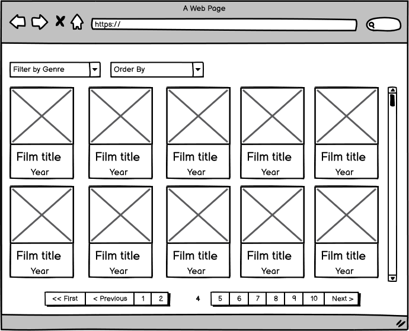
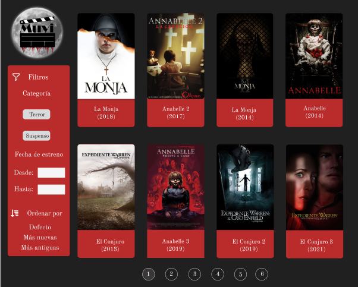
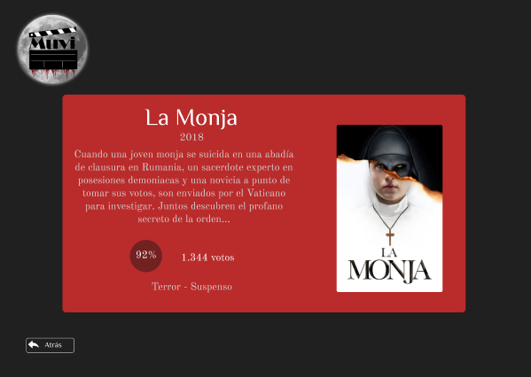

#  MUVI

**MUVI** es la plataforma donde puedes encontrar información de tus películas favoritas de **terror** y **suspenso**, aquí podrás
elegir que película ver esta noche según la información que te brindamos.

### Funcionalidades

En MUVI podrás ordenar las películas por **más nuevas** o **más antiguas**
Podrás filtrar las películas por año de estreno y también podrás elegir entre las categorías **terror** y **suspenso**
Al hacer click sobre una película serás dirigido a una nueva vista, donde verás información relevante de la película seleccionada,
como su título, año de estreno, descripción, cantidad de votos y género.

## Tecnologías utilizada

Para la construcción de MUVI se utilizó lo siguiente:

- **React**: Como framework para el desarrollo
- **TypeScript**: Como lenguaje de programación
- **The Movie Database API V3**: Como API para obtener el catálogo de películas

## Diseño y desarrollo

1. **Prototipo de baja fidelidad**: Este diseño fue entregado por el product owner.

2. **Prototipo de alta fidelidad**: Este diseño fue realizado en [figma] (https://www.figma.com/proto/1vGlrHd4w9yGh3cgGfTLaY/Untitled?type=design&node-id=1-4&t=yiA41hmUi51H1sUS-1&scaling=scale-down&page-id=0%3A1&starting-point-node-id=1%3A4&mode=design).

3. **Desarrollo**: MUVI se desarrolló en base a los prototipos buscando siempre un diseño intuitivo y fácil
de comprender para el usuario.
No olvides visitar **[MUVI](https://muvi-nine.vercel.app)**

